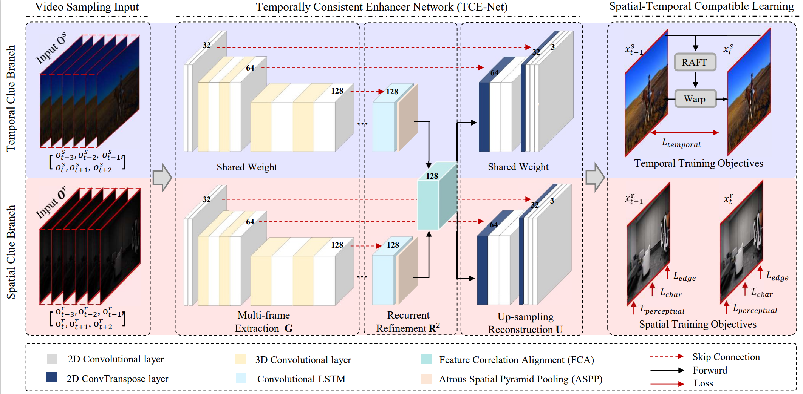

# Temporally Consistent Enhancement of Low-light Videos via Spatial-Temporal Compatible Learning

## Abstract
Temporal inconsistency is the annoying artifact that has been commonly introduced in low-light video enhancement, but current methods tend to overlook the significance of utilizing both data-centric clues and model-centric design to tackle this problem. In this context, our work makes a comprehensive exploration from the following three aspects. First, to enrich the scene diversity and motion flexibility, we construct a synthetic diverse low/normal-light paired video dataset with a carefully designed low-light simulation strategy, which can effectively complement existing real captured datasets. Second, for better temporal dependency utilization, we develop a Temporally Consistent Enhancer Network (TCE-Net) that consists of stacked 3D convolutions and 2D convolutions to exploit spatial-temporal clues in videos. Last, the temporal dynamic feature dependencies are exploited to obtain consistency constraints for different frame indexes. All these efforts are powered by a Spatial-Temporal Compatible Learning (STCL) optimization technique, which dynamically constructs specific training loss functions adaptively on different datasets. As such, multiple-frame information can be effectively utilized and different levels of information from the network can be feasibly integrated, thus expanding the synergies on different kinds of data and offering visually better results in terms of illumination distribution, color consistency, texture details, and temporal coherence.



## Dataset

### SDSD dataset
We use the original SDSD datasets with dynamic scenes.

And you can download the SDSD-indoor and SDSD-outdoor from [link](https://github.com/dvlab-research/SDSD).

### DRV dataset
We use its full images for SMID and transfer the RAWdata to RGB since our work explores low-light image enhancement in the RGB domain.

You can download the dataset from [link]([https://github.com/cchen156/Seeing-Motion-in-the-Dark](https://github.com/cchen156/Seeing-Motion-in-the-Dark)).

### DS-LOL dataset
You can download our synthetic low-light video dataset from [link]().

## Project Setup

First install Python 3. We advise you to install Python 3 and PyTorch with Anaconda:

```
conda create --name py36 python=3.6
source activate py36
```

Clone the repo and install the complementary requirements:
```
cd $HOME
pip install -r requirements.txt
```

## Usage
### Train
Train the model on the corresponding dataset using the command, the training on outdoor subset of SDSD:
```
CUDA_VISIBLE_DEVICES=0 python main.py --mode train --version Exp_outdoor_20231001 --use_tensorboard True --is_test_psnr_ssim True --use_pretrained_raft True
```

Train the model on the corresponding dataset using the command, the training on indoor subset of SDSD:
```
CUDA_VISIBLE_DEVICES=0 python main.py --mode train --version Exp_indoor_20231001 --use_tensorboard True --is_test_psnr_ssim True --use_pretrained_raft True
```

### Test
Test the model on the corresponding dataset using the command, the testing on outdoor subset of SDSD:
```
CUDA_VISIBLE_DEVICES=0 python main.py --mode test --version Exp_outdoor_20231001
```

Test the model on the corresponding dataset using the command, the testing on indoor subset of SDSD:
```
CUDA_VISIBLE_DEVICES=0 python main.py --mode test --version Exp_indoor_20231001
```

We adopt PSNR, SSIM, and Feature SIMilarity Index (FSIM) as comparison criteria to evaluate the spatial quality of enhanced video frames, which are based upon the implementations with MATLAB (R2018b).

### Pre-trained Model
You can download our trained model using the following links:

the model trained with indoor subset in [SDSD_indoor](https://github.com/lingyzhu0101/low-light-video-enhancement/tree/lingyzhu0101).

the model trained with outdoor subset in [SDSD_outdoor](https://github.com/lingyzhu0101/low-light-video-enhancement/tree/lingyzhu0101).

the model trained with [DRV](https://github.com/lingyzhu0101/low-light-video-enhancement/tree/lingyzhu0101).

the optical flow model [RAFT](https://github.com/princeton-vl/RAFT)

## Citation Information
If you find the project useful, please cite:
```
```

## Acknowledgments
This source code is inspired by [UEGAN](https://github.com/eezkni/UEGAN)


